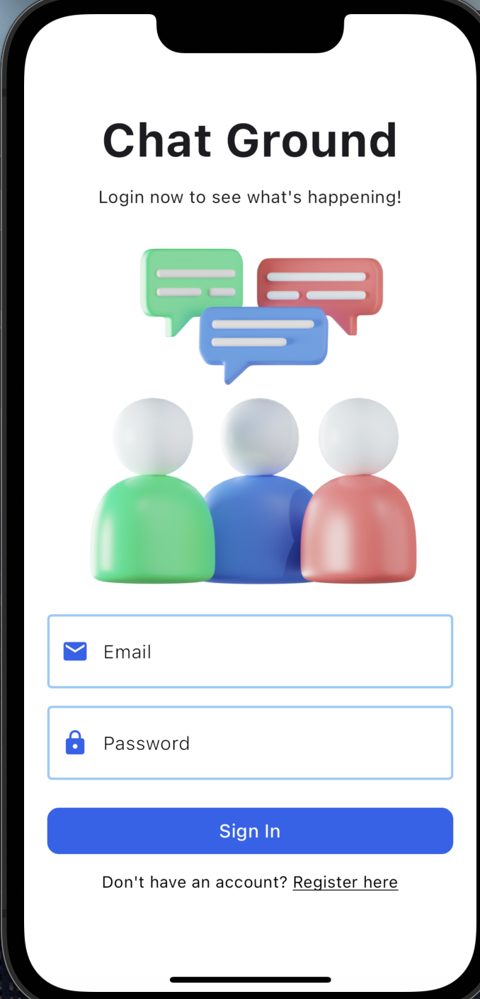

# chat_app

Installation

```
flutter pub get
```
Usage 

```
flutter run
```

### Features

Things covered in this Chat App Task:
- Firebase Auth :  Sign in, Sign up and Sign out
- Firebase Firestore : Upload & Retrieve data stored in Cloud Firestore
- Perform simple and compound queries in Cloud Firestore
- Building Complexe UI 
- Shared Preference to keep user logged in, Create chat room ( with username) & Send message ( by username)
- Using Stream & Stream builder


